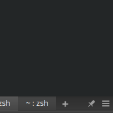

# Soda Dark (Yakuake Skin)

Assets are cropped from Sublime Text 3's [Soda Dark theme](https://github.com/buymeasoda/soda-theme) by Ian Hill (http://buymeasoda.com/) which is under the [Creative Commons Attribution-ShareAlike 3.0 License (CC-By-SA-3.0)](http://creativecommons.org/licenses/by-sa/3.0/).

This skin [was originally](https://github.com/Zren/yakuake-sodadark-thintitlebar/tree/v2) based on the [breeze-minimal skin](https://store.kde.org/p/1106236) which creates a thin 2px tall titlebar with tiny buttons for the StayOnTop, Configure, and Quit buttons. We now use new Yakuake skin techniques (added in 2019) to place those buttons in the TabBar.

https://store.kde.org/p/1165686/

## Changelog

* Soda Dark v3: Uses the new 2019 Yakuake Skin features for a Compact Titlebar that combines the titlebar buttons in the tab bar. Can only drag to resize in a small area left of the pin button.
* Soda Dark v2: Uses a very short titlebar which is 2px tall. It is easier to resize anywhere along the bottom edge.

## Yakuake Skin Documentation

* Yakuake Skin Logic: https://invent.kde.org/utilities/yakuake/-/blob/master/app/skin.cpp
* 2019-03-17: https://phabricator.kde.org/D19835
	* `title.skin`
		* Added `[FocusButton] anchor=left` (or `right`)
		* Added `[ConfigButton] anchor=left` (or `right`)
		* Added `[QuitButton] anchor=left` (or `right`)
		* Added `[Text] centered=false` (or `true`)
	* `tabs.skin`
		* Added `[Tabs] selected_text_bold=true` (or `false`)
		* Added `[Tabs] compact=false` (or `true`)
		* Added `[PlusButton] at_end_of_tabs=false` (or `true`)

### Compact Mode

When in `[Tabs] compact=true` mode, Yakuake will use the width of the `[MinusButton]` (aka close tab) to determine the right most point of the TabBar (`rect.x2`).

Code: https://invent.kde.org/utilities/yakuake/-/blob/master/app/skin.cpp#L148

So to make the `[FocusButton]`, `[ConfigButton]` and `[QuitButton]` visible on the right side in compact mode, we need to set this `[MinusButton] x=120` since `120 = 4 * 30px `.

Since a user can `Ctrl+Shift+W` or middle click to close a tab, and "Quit Yakuake" is available in the ConfigButton dropdown, we hide both of those buttons. So we only need `[MinusButton] x=60`.

